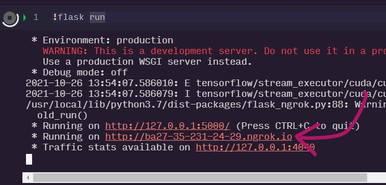
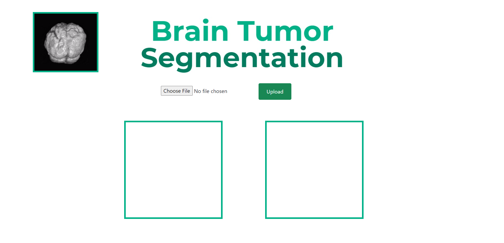
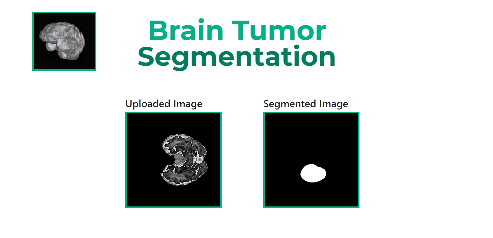

# BrainTumorSeg

### [[Detailed Documentation]](https://github.com/AdityaG09/BrainTumorSeg/blob/main/docs/Brain%20Tumor%20Segmentation%20-%20HPE%20Project%20Documentation.pdf)
This project was done as a capstone project during the GAIP Summer 2021 internhip. We aimed to develop a Deep Learning solution for segmenting HGG brain tumors.

## Demo

Structure of directories
```
BrainTumorSeg/
    |--data/：Source for dataset
    |   |--Links To Processed Data.md：Links to the processed train and test data
    |	|--REFERENCES.md/：References to where the dataset was taken from
    |--docs/：Detailed Documentation
    |   |--Brain Tumor Segmentation - HPE Project Documentation.pdf：Capstone Project Doc
    |--notebooks/：Jupyter notebooks for the Deep Learning architectures used
    |	|--01-UNet Model.ipynb/：UNet model 
    |	|--02-ResUNet Model.ipynb/：ResUNet model
    |--src/：Code for web app
    |   |--static
    |   |   |--Capture.jpeg：Banner pic displayed in app
    |   |   |--new_1.png: Demo output of input slice image
    |   |   |--pred_1.png: Demo output of segmented input slice image
    |   |   |--unnamed.gif：GIF displayed in app
    |   |--templates
    |   |   |--index.html
    |   |   |--success.html
    |   |--BraTS19_2013_7_1_t1.nii: Demo NIfTI file to be used for testing app
    |   |--app.py
    |   |--dockerfile: Ready to use dockerfile for deployment
    |   |--red_weights2.h5: Pre-trained weights for UNet model
    |   |--requirements.txt
    |--README.md
```

To try the demo of the app on Google Colab, first download the Demo NIfTI file found in [BrainTumorSeg/src/BraTS19_2013_7_1_t1.nii](https://github.com/AdityaG09/BrainTumorSeg/blob/main/src/BraTS19_2013_7_1_t1.nii) to your local machine and then follow the below steps

```
!git clone https://github.com/AdityaG09/BrainTumorSeg.git
!pip install -r requirements.txt
!pip install flask_ngrok
cd BrainTumorSeg/src
!flask run
```
Then click on the flask-ngrok link like the one shown below.



You should then see the UI show up like so



Now upload the Demo NIfTI file you downloaded previously. This should give an output like so 




